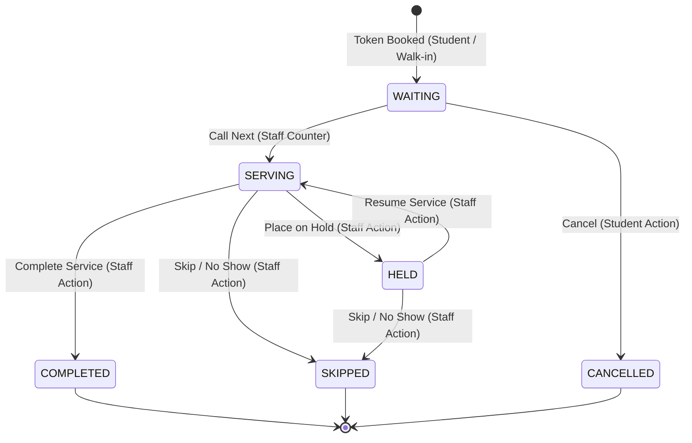

# QueueCraft Backend Architecture & Technical Specifications

This document outlines the complete backend architecture, database models, REST APIs, real-time WebSocket communication channels, state machine guidelines, and testing criteria for **QueueCraft**—a university smart queue and counter management system.

---

## 1. System Overview & Technology Stack

QueueCraft's backend is a TypeScript Node.js server designed for low latency, real-time responsiveness, and ACID-compliant state transitions.

*   **Server Runtime:** Node.js (with ESM modules)
*   **Language:** TypeScript
*   **Web Framework:** Express.js (REST APIs)
*   **Real-time Gateway:** Socket.io (WebSockets for dynamic dashboard synching)
*   **Database:** SQLite via `better-sqlite3` (synchronous execution, low overhead, journal mode `WAL` for concurrent reads/writes, foreign keys enforced)
*   **Execution Sandbox / Tooling:** `tsx` for TypeScript execution, Vitest for integration testing, Supertest for HTTP endpoint testing.

---

## 2. Database Schema

SQLite schema definition with strict data-type constraints and relational integrity constraints.

```sql
-- Enforced via: PRAGMA foreign_keys = ON;
-- Optimized via: PRAGMA journal_mode = WAL;

-- 1. USERS TABLE (Students, Staff, and Admins)
CREATE TABLE IF NOT EXISTS users (
  id TEXT PRIMARY KEY,
  name TEXT NOT NULL,
  email TEXT UNIQUE NOT NULL,
  password_hash TEXT NOT NULL,
  role TEXT NOT NULL CHECK(role IN ('STUDENT', 'STAFF', 'ADMIN')),
  created_at DATETIME DEFAULT CURRENT_TIMESTAMP
);

-- 2. SERVICES TABLE (Different departments offering queues)
CREATE TABLE IF NOT EXISTS services (
  id TEXT PRIMARY KEY,
  name TEXT NOT NULL,
  code TEXT UNIQUE NOT NULL, -- e.g. 'LP' (Library Printer), 'ADM' (Admin Office)
  description TEXT,
  created_at DATETIME DEFAULT CURRENT_TIMESTAMP
);

-- 3. COUNTERS TABLE (Operational service counters/desks)
CREATE TABLE IF NOT EXISTS counters (
  id TEXT PRIMARY KEY,
  service_id TEXT NOT NULL,
  name TEXT NOT NULL, -- e.g. 'Printer Counter 1'
  status TEXT NOT NULL DEFAULT 'CLOSED' CHECK(status IN ('OPEN', 'CLOSED', 'BUSY', 'MAINTENANCE')),
  assigned_staff_id TEXT UNIQUE, -- One-to-one assignment for active sessions
  created_at DATETIME DEFAULT CURRENT_TIMESTAMP,
  FOREIGN KEY (service_id) REFERENCES services(id) ON DELETE CASCADE,
  FOREIGN KEY (assigned_staff_id) REFERENCES users(id) ON DELETE SET NULL
);

-- 4. TOKENS TABLE (Queue tickets booked by/for students)
CREATE TABLE IF NOT EXISTS tokens (
  id TEXT PRIMARY KEY,
  token_number TEXT NOT NULL, -- Format: Code-XXX (e.g. 'LP-041')
  student_id TEXT, -- Associated logged-in student account (optional for walk-ins)
  student_name TEXT NOT NULL,
  student_email TEXT,
  service_id TEXT NOT NULL,
  counter_id TEXT, -- Assigned counter when status is SERVING, COMPLETED, HELD, or SKIPPED
  priority TEXT NOT NULL DEFAULT 'NORMAL' CHECK(priority IN ('NORMAL', 'HIGH')),
  status TEXT NOT NULL DEFAULT 'WAITING' CHECK(status IN ('WAITING', 'SERVING', 'HELD', 'COMPLETED', 'SKIPPED', 'CANCELLED')),
  created_at DATETIME NOT NULL DEFAULT CURRENT_TIMESTAMP,
  started_at DATETIME,    -- Populated when counter calls token
  completed_at DATETIME,  -- Populated when service is completed
  skipped_at DATETIME,    -- Populated when skipped
  held_at DATETIME,       -- Populated when put on hold
  notes TEXT,             -- Resolution notes
  FOREIGN KEY (service_id) REFERENCES services(id) ON DELETE CASCADE,
  FOREIGN KEY (counter_id) REFERENCES counters(id) ON DELETE SET NULL,
  FOREIGN KEY (student_id) REFERENCES users(id) ON DELETE SET NULL
);

-- INDEXES FOR MAXIMUM QUERY PERFORMANCE
CREATE INDEX IF NOT EXISTS idx_tokens_service_status ON tokens(service_id, status);
CREATE INDEX IF NOT EXISTS idx_tokens_counter_status ON tokens(counter_id, status);
CREATE INDEX IF NOT EXISTS idx_tokens_created_priority ON tokens(priority, created_at);
CREATE INDEX IF NOT EXISTS idx_counters_assigned_staff ON counters(assigned_staff_id);
```

---

## 3. Queue State Machine & Business Logic

### Token Lifecycle & State Transitions

A token progresses through defined operational states:



### Queue Ordering Algorithm (FCFS with Priority)

Tokens in state `WAITING` are called sequentially using a priority-aware First-Come, First-Served (FCFS) model:
1.  **Priority Filter:** All tokens flagged with `priority = 'HIGH'` are processed before any token flagged with `priority = 'NORMAL'`.
2.  **Chronological Ordering:** Within each priority group, tokens are sorted chronologically by `created_at ASC`.

*Query Implementation:*
```sql
SELECT * FROM tokens
WHERE service_id = ? AND status = 'WAITING'
ORDER BY
  CASE priority WHEN 'HIGH' THEN 1 ELSE 2 END ASC,
  created_at ASC
LIMIT 1;
```

### Concurrency & Transaction Safeguards

To prevent race conditions (e.g., two staff members at separate counters pulling the same ticket simultaneously), the ticket selection and status update must occur inside an ACID transaction:
1.  Open SQLite transaction.
2.  Verify the counter is `OPEN` and has no current `SERVING` ticket.
3.  Query the next eligible ticket.
4.  If ticket exists, change status to `SERVING` and write `counter_id` & `started_at = CURRENT_TIMESTAMP`.
5.  Commit transaction.

---

## 4. API Endpoints Specification

### 4.1 Authentication REST API (`/api/auth`)

#### User Login
*   **Path:** `POST /api/auth/login`
*   **Auth Required:** No
*   **Request Body:**
    ```json
    {
      "email": "rudresh@queuecraft.edu",
      "password": "password123"
    }
    ```
*   **Success Response (200 OK):**
    ```json
    {
      "token": "eyJhbGciOiJIUzI1NiIsIn...",
      "user": {
        "id": "usr-staff-rudresh",
        "name": "Rudresh",
        "email": "rudresh@queuecraft.edu",
        "role": "STAFF",
        "created_at": "2026-08-18T23:59:10.000Z"
      },
      "counter": {
        "id": "cntr-lp-2",
        "service_id": "srv-lp",
        "name": "Printer Counter 2",
        "status": "OPEN",
        "assigned_staff_id": "usr-staff-rudresh"
      }
    }
    ```

#### Retrieve Self Identity
*   **Path:** `GET /api/auth/me`
*   **Auth Required:** Yes (JWT Bearer Token)
*   **Success Response (200 OK):**
    ```json
    {
      "user": {
        "id": "usr-staff-rudresh",
        "name": "Rudresh",
        "email": "rudresh@queuecraft.edu",
        "role": "STAFF",
        "created_at": "2026-08-18T23:59:10.000Z"
      },
      "counter": {
        "id": "cntr-lp-2",
        "service_id": "srv-lp",
        "name": "Printer Counter 2",
        "status": "OPEN"
      }
    }
    ```

---

### 4.2 Student Experience REST API (`/api/student`)

#### Fetch Available Service Categories
*   **Path:** `GET /api/student/services`
*   **Auth Required:** Yes (Role: `STUDENT`)
*   **Success Response (200 OK):**
    ```json
    [
      {
        "id": "srv-lp",
        "name": "Library Printer",
        "code": "LP",
        "description": "High-speed printing, binding, and scanning services in the Central Library."
      }
    ]
    ```

#### Fetch Active Counters
*   **Path:** `GET /api/student/counters`
*   **Auth Required:** Yes (Role: `STUDENT`)
*   **Success Response (200 OK):**
    ```json
    [
      {
        "id": "cntr-lp-2",
        "name": "Printer Counter 2",
        "service_id": "srv-lp",
        "status": "OPEN",
        "service_name": "Library Printer",
        "service_code": "LP"
      }
    ]
    ```

#### Request / Book Queue Token (Phase 2 Add-on)
*   **Path:** `POST /api/student/tokens`
*   **Auth Required:** Yes (Role: `STUDENT`)
*   **Request Body:**
    ```json
    {
      "service_id": "srv-lp",
      "priority": "NORMAL",
      "notes": "Printing lecture slides"
    }
    ```
*   **Success Response (201 Created):**
    ```json
    {
      "id": "tkn-046",
      "token_number": "LP-046",
      "student_id": "usr-student-demo",
      "student_name": "Demo Student",
      "student_email": "student@queuecraft.edu",
      "service_id": "srv-lp",
      "priority": "NORMAL",
      "status": "WAITING",
      "created_at": "2026-08-19T00:10:00.000Z"
    }
    ```

#### Retrieve Student Active Token (Phase 2 Add-on)
*   **Path:** `GET /api/student/tokens/active`
*   **Auth Required:** Yes (Role: `STUDENT`)
*   **Success Response (200 OK):**
    ```json
    {
      "id": "tkn-046",
      "token_number": "LP-046",
      "status": "WAITING",
      "queue_position": 3,
      "estimated_wait_minutes": 14.5
    }
    ```

#### Cancel Ticket (Phase 2 Add-on)
*   **Path:** `POST /api/student/tokens/:tokenId/cancel`
*   **Auth Required:** Yes (Role: `STUDENT` & Token Owner)
*   **Success Response (200 OK):**
    ```json
    {
      "message": "Token LP-046 successfully cancelled."
    }
    ```

---

### 4.3 Staff Queue Operations REST API (`/api/staff`)

*Note: All endpoints require authentication token, `STAFF` role, and an active counter assignment session.*

#### Retrieve Consolidated Dashboard
*   **Path:** `GET /api/staff/dashboard`
*   **Success Response (200 OK):**
    ```json
    {
      "staff": { "id": "usr-staff-rudresh", "name": "Rudresh" },
      "counter": {
        "id": "cntr-lp-2",
        "name": "Printer Counter 2",
        "status": "OPEN",
        "service_id": "srv-lp",
        "service_name": "Library Printer",
        "service_code": "LP"
      },
      "current_token": {
        "id": "tkn-041",
        "token_number": "LP-041",
        "student_name": "Aarav Sharma",
        "status": "SERVING",
        "started_at": "2026-08-18T23:49:10.000Z"
      },
      "waiting_queue": [
        { "id": "tkn-044", "token_number": "LP-044", "priority": "HIGH" },
        { "id": "tkn-042", "token_number": "LP-042", "priority": "NORMAL" }
      ],
      "stats": {
        "queue_length": 2,
        "currently_serving_number": "LP-041",
        "waiting_count": 2,
        "held_count": 1,
        "completed_today_count": 2,
        "avg_service_time_minutes": 6.8
      }
    }
    ```

#### Call Next Token
*   **Path:** `POST /api/staff/counter/next`
*   **Success Response (200 OK):**
    ```json
    {
      "message": "Token LP-044 called successfully",
      "token": {
        "id": "tkn-044",
        "token_number": "LP-044",
        "status": "SERVING",
        "counter_id": "cntr-lp-2",
        "started_at": "2026-08-19T00:02:15.000Z"
      },
      "dashboard": { ... }
    }
    ```

#### Complete Current Service
*   **Path:** `POST /api/staff/tokens/:tokenId/complete`
*   **Success Response (200 OK):**
    ```json
    {
      "message": "Token LP-044 completed",
      "token": {
        "id": "tkn-044",
        "token_number": "LP-044",
        "status": "COMPLETED",
        "completed_at": "2026-08-19T00:11:45.000Z"
      },
      "dashboard": { ... }
    }
    ```

#### Hold Current Token
*   **Path:** `POST /api/staff/tokens/:tokenId/hold`
*   **Success Response (200 OK):**
    ```json
    {
      "message": "Token LP-044 placed on hold",
      "token": {
        "id": "tkn-044",
        "status": "HELD",
        "held_at": "2026-08-19T00:15:30.000Z"
      },
      "dashboard": { ... }
    }
    ```

#### Resume Held Token
*   **Path:** `POST /api/staff/tokens/:tokenId/resume`
*   **Success Response (200 OK):**
    ```json
    {
      "message": "Token LP-044 resumed to SERVING",
      "token": {
        "id": "tkn-044",
        "status": "SERVING",
        "started_at": "2026-08-19T00:17:10.000Z"
      },
      "dashboard": { ... }
    }
    ```

#### Skip Token (No Show)
*   **Path:** `POST /api/staff/tokens/:tokenId/skip`
*   **Success Response (200 OK):**
    ```json
    {
      "message": "Token LP-044 skipped",
      "token": {
        "id": "tkn-044",
        "status": "SKIPPED",
        "skipped_at": "2026-08-19T00:20:00.000Z"
      },
      "dashboard": { ... }
    }
    ```

#### Update Counter Desk Operational Status
*   **Path:** `PATCH /api/staff/counter/status`
*   **Request Body:**
    ```json
    {
      "status": "BUSY" // Allowed values: OPEN, CLOSED, BUSY, MAINTENANCE
    }
    ```
*   **Success Response (200 OK):**
    ```json
    {
      "message": "Counter status updated to BUSY",
      "counter": { "id": "cntr-lp-2", "status": "BUSY" },
      "dashboard": { ... }
    }
    ```

---

## 5. Real-Time WebSockets Architecture

Socket.io is used to broadcast event states, removing the need for client-side REST polling.

### Room Subscriptions
Clients connect and join specific rooms for selective real-time syncing:
*   **Department Room (`service:<serviceId>`)**: Listens to changes in the queue length or status updates.
*   **Counter Room (`counter:<counterId>`)**: Listens to changes to a specific desk (e.g. caller notification).

### Emitted Events (Backend -> Client)

| Event Name | Room | Payload | Purpose |
| :--- | :--- | :--- | :--- |
| `token:called` | `counter:<counterId>` | `{ token: TokenRecord }` | Updates staff screen and public voice/display board. |
| `token:completed` | `counter:<counterId>` | `{ token: TokenRecord }` | Updates dashboard stats and frees the desk screen. |
| `token:held` | `counter:<counterId>` | `{ token: TokenRecord }` | Updates dashboard list to move ticket to held group. |
| `token:resumed` | `counter:<counterId>` | `{ token: TokenRecord }` | Transitions ticket back to active service. |
| `token:skipped` | `counter:<counterId>` | `{ token: TokenRecord }` | Frees desk screen, moves ticket to audit/skipped state. |
| `queue:updated` | `service:<serviceId>` | `{ action: string, tokenId?: string }` | Forces student screen to recalculate wait position. |
| `counter:status` | `counter:<counterId>` | `{ status: string }` | Notifies student discovery that counter has opened/closed. |

---

## 6. Verification and Testing Framework

The backend operations are fully tested using **Vitest** for script runners and assertions, and **Supertest** for Mock Express requests.

### Executing Tests
To run integration tests covering the queue state machine transitions, access control lists (RBAC), and authentication:
```bash
npm run test
```

### Executing Seeds
To reset and re-populate the SQLite database with rich mock data for local manual testing:
```bash
npm run seed
```
